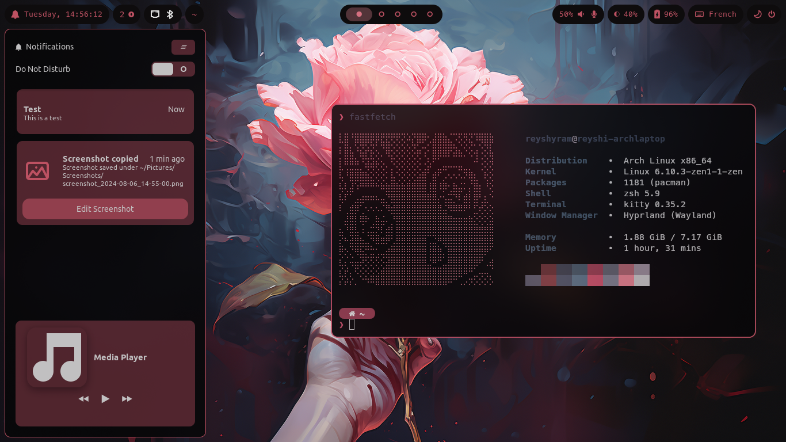
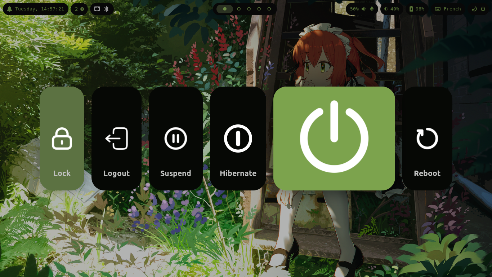
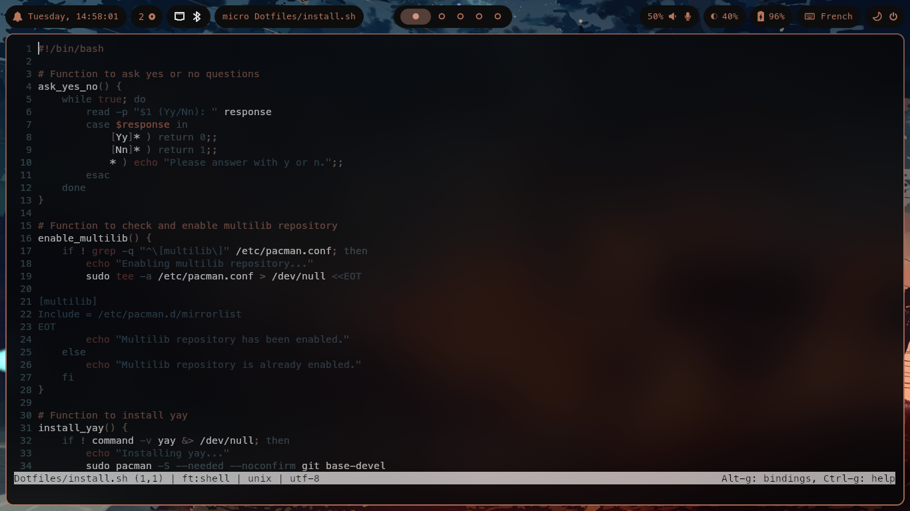
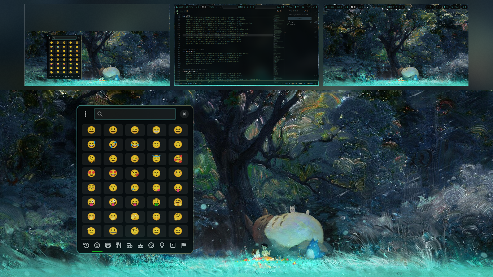
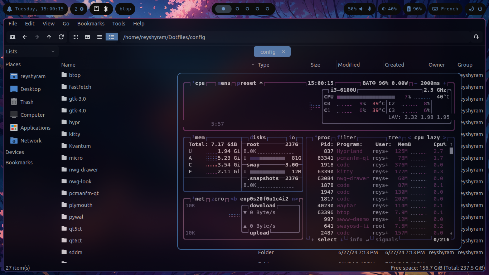

# Installation

>[!CAUTION]
>The installation script is meant to be used on a minimal Arch installation, and will install refind as the boot manager. It will replace any existing configuration. Please proceed with caution.

First, update your system.
```
sudo pacman -Syu
```

Then, install git.
```
sudo pacman -S git
```

After that, you can now clone the repository:
```
git clone https://github.com/Reyshyram/Dotfiles.git
```

Then, cd into the directory containing the dotfiles:
```
cd Dotfiles
```

Finally, make sure the install script has the required permissions and launch it.
```
chmod +x ./install.sh && ./install.sh
```

Follow the instructions on your terminal. If there's a problem, feel free to open an issue.
After rebooting, a window will show up asking you to perform the post install steps.

## Informations

This rice relies heavily on pywal for generating color schemes. Colors of most apps will be updated with the colors of your wallpaper when selecting a new one.

You can show a list of keybinds using the `Super + /` (or the key to the left of Right Shift) shortcut.

You can modify your keyboard language by editing the `~/.config/hypr/input.conf` file.

You can change your wallpaper using `Super + H`, or select a random one using `Super + Shift + H`. To add new wallpapers, put them in `~/Pictures/Wallpapers`.

You can modify your display settings using the nwg-displays app.

You may want to replace the file `~/.config/hypr/profile-picture.png` by your own profile picture.

# Preview






