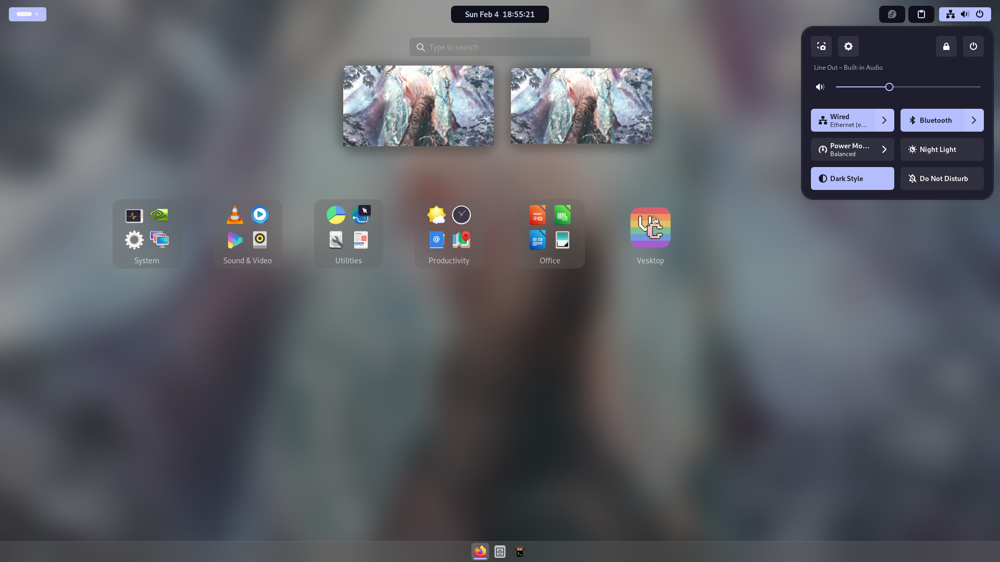

# How to use

In order to install my dotfiles, you first need to clone the repository :

    git clone https://github.com/Reyshyram/Dotfiles.git
Then, cd into the directory containing the dotfiles :

    cd Dotfiles
Finally, launch the install script :

    ./install.sh
The installation should now be completed. If there is any problem, feel free to open an issue.

## Compatibility
This script is only confirmed to be working under Fedora 39 and Gnome 45, because it uses dnf in order to install the required packages.

# Preview :

# Shortcuts
|Action|Keybind|
|--|--|
| Exit an app | Super + Q|
| Resize a window | Super + Right Click|
| Move a window | Super + Left Click|
| Open the browser | Super + F |
| Open the file manager | Super + E |
| Open the terminal | Super + T |
| Open a notepad | Super + B |

